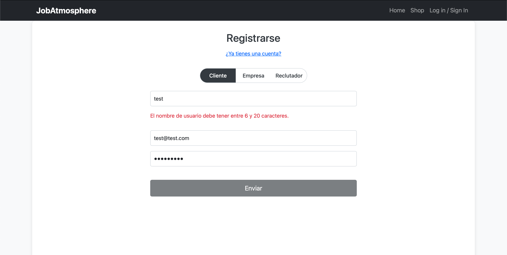
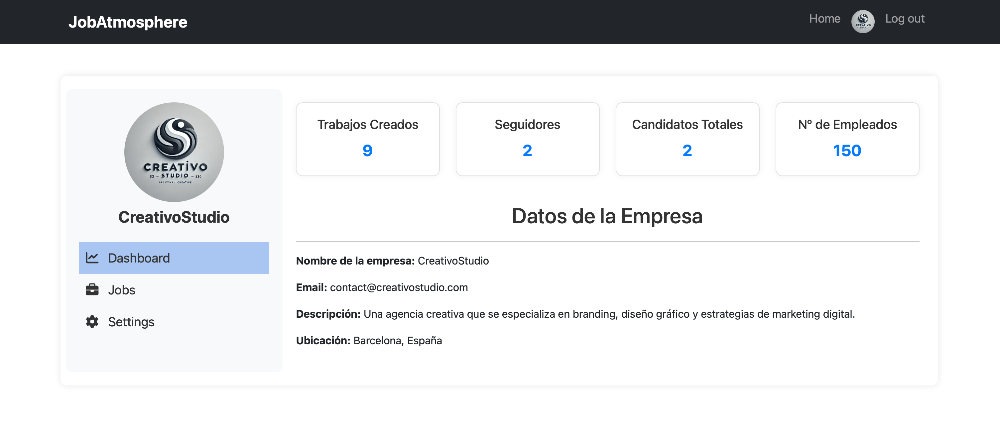
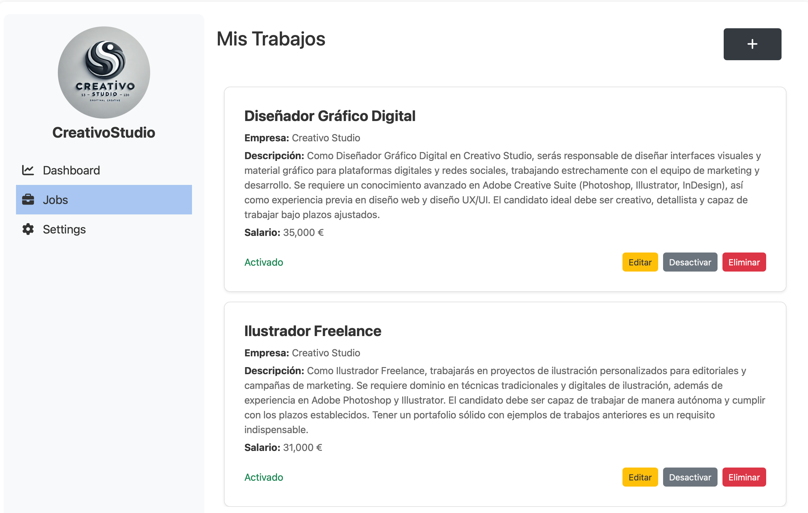

# Guía de Navegación de JobAtmosphere

Este documento proporciona una descripción detallada de cada sección de la plataforma **JobAtmosphere**, explicando las funcionalidades y opciones que encontrarás en cada una. La plataforma está diseñada para brindar una experiencia fácil e intuitiva para candidatos, empresas y reclutadores.

---

## Índice

1. [Home](#1-home)
2. [Shop](#2-shop)
3. [Details Job](#3-details-job)
4. [Details Company](#4-details-company)
5. [Register](#5-register)
6. [Login](#6-login)
7. [Profile User](#7-profile-user)
8. [Dashboard Company](#8-dashboard-company)
9. [Dashboard Recruiter](#9-dashboard-recruiter)

---

## 1. Home

La página de inicio de JobAtmosphere sirve como punto de entrada a la plataforma. Aquí podrás:
- **Carrusel de Categorías**: Una bonito carrusel con las principales imágenes de cada categoría y un redireccionamiento al shop.
- **Navegar por Categorías**: Visualiza diferentes sectores de empleo para facilitar tu búsqueda según tus intereses, haz scroll para que sigan cargando categorías.

## 2. Shop

La página **Shop** permite realizar una búsqueda avanzada y específica de trabajos:
- **Filtrado por Categoría**: Selecciona entre diferentes sectores para encontrar empleos específicos.
- **Filtrado por Salario**: Define un rango salarial mínimo y máximo para ver solo trabajos que se ajusten a tus expectativas.
- **Aplicación de Filtros Múltiples**: Puedes combinar varios filtros para encontrar trabajos que realmente se ajusten a tus necesidades.
- **Search**: Es posible buscar los trabajos por el nombre mediante el nombre gracias al search, funciona dinámicamente pero también puedes pulsar el botón.
- **Restablecer Filtros**: Si deseas empezar de nuevo, puedes restablecer todos los filtros con el botón que hay lado de los filtros.
- **Trabajos**: En cada tarjeta de un trabajo se puede apreciar el nombre de la oferta, la empresa que lo publica con su imagen, el salario anual, ver detalles y la posibilidad de que los candidatos puedan añadirlo a favoritos.
- **Paginación**: Los trabajos se muestran de 4 en 4, tienes la posibilidad de navegar entre páginas para ver todas los trabajos.

> **Tip:** Se guarda automáticamente la página en la que estás actualmente para que no te pierdas en la navegación.

## 3. Details Job

En esta página encontrarás toda la información detallada de una oferta de trabajo específica:
- **Descripción del Trabajo**: Lee una descripción completa del puesto, los requisitos y las responsabilidades.
- **Salario y Ubicación**: Información clara sobre el salario ofrecido del empleo.
- **Aplicar al Trabajo**: Los candidatos pueden aplicar directamente a este puesto con solo un clic.
- **Añadir a Favoritos**: Guarda el trabajo en tu lista de favoritos para revisarlo más tarde.
- **Ver Empresa**: Accede a más detalles sobre la empresa que ofrece el puesto.
- **Añadir Comentarios**: Diferentes candidatos pueden añadir comentarios sobre la oferta de trabajo.

## 4. Details Company 

La página de detalles de una empresa permite a los usuarios conocer más sobre una organización:
- **Información General de la Empresa**: Descripción de la misión, visión y objetivos de la empresa.
- **Seguir a la Empresa**: Los candidatos pueden seguir a la empresa.
- **Contacto**: Información adicional como el correo electrónico y la ubicación principal de la empresa.

## 5. Register 

La página de registro permite a nuevos usuarios crear su cuenta en JobAtmosphere:
- **Registro para Diferentes Roles**: Completa el formulario de registro especificando si eres candidato, empresa o reclutador.
- **Información Básica**: Proporciona datos personales básicos y crea una contraseña segura.
- **Validación**: Se validan los datos que ingresas a tiempo real para comprobar que son compatibles con el registro.

> **Tip:** Completa la información de perfil una vez que registres tu cuenta para optimizar tu experiencia en JobAtmosphere.

## 6. Login

La página de inicio de sesión permite a los usuarios acceder a sus cuentas de JobAtmosphere:
- **Inicio de Sesión Unificado**: Candidatos, empresas y reclutadores utilizan el mismo formulario para iniciar sesión.
- **Selección de Tipo de Usuario**: Elige tu tipo de usuario (candidato, empresa o reclutador) antes de iniciar sesión.
- **Validación**: Se usa la misma validación que tiene el register.

> **Tip:** Si no te acuerdas de la contraseña tendrás que contactar con un administrador.

## 7. Profile User

La página de perfil está diseñada para los candidatos y permite:
- **Ver Perfil**: Visualizar toda tu información.

- **Actualizar Datos Personales**: Edita tu información como el nombre, el email, la descripción sobre ti, la contraseña y la foto de perfil.

- **Lista de Trabajos Favoritos**: Revisa los empleos que has marcado como favoritos.

> **Tip:** Mantén tu perfil actualizado para mejorar tus posibilidades de ser seleccionado por los reclutadores.

## 8. Dashboard Company 

Esta sección es el centro de control para las empresas registradas en JobAtmosphere:

- **Métricas y Datos de Empresa**: Analiza el rendimiento de tus publicaciones mediante el número de vistas, seguidores y aplicaciones recibidas y visualiza tus datos de la empresa.

- **Actualizar Información de la Empresa**: Cambia los datos básicos de la empresa, como la descripción, la cantidad de empleados y la ubicación.

- **Publicar Nuevos Trabajos**: Crea nuevas ofertas de empleo detallando el puesto, el salario y los requisitos.

- **Gestionar Ofertas Actuales**: Edita, activa o elimina trabajos según las necesidades de la empresa.

> **Tip:** Utiliza los análisis para mejorar tus descripciones de trabajo y atraer a más candidatos.

## 9. Dashboard Recruiter 

El panel para reclutadores permite gestionar los procesos de selección de candidatos de manera efectiva:

- **Perfil Reclutador**: Métricas que indican las selecciones que tienes en curso y cuando candidados se han inscrito entre todas las selecciones.

- **Ver Trabajos Asignados**: Accede a la lista de trabajos que tienes asignados y gestiona cada proceso de selección.

- **Revisar Candidatos y Cambiar el Estado de la Aplicación**: Para cada oferta, puedes revisar la lista de candidatos que han aplicado y utilizar un menú de opciones para cambiar el estado de cada candidato (pendiente, aceptado, rechazado).

- **Actualizar Perfil de Reclutador**: Ajusta tu estado para que se te asignen más aplicaciónes de trabajo.

> **Tip:** Gracias a las métricas con un simple vistazo puedes ver todo el trabajo que tienes pendiente.

---

Estas páginas y funciones hacen que JobAtmosphere sea una plataforma completa y fácil de usar, orientada a satisfacer las necesidades de cada usuario en su búsqueda de empleo o gestión de reclutamiento. Esperamos que encuentres esta guía útil y que disfrutes explorando todas las herramientas que hemos desarrollado para mejorar tu experiencia laboral.